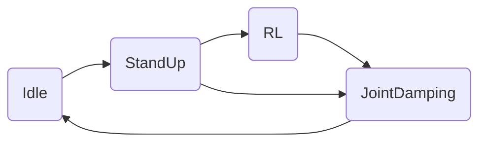
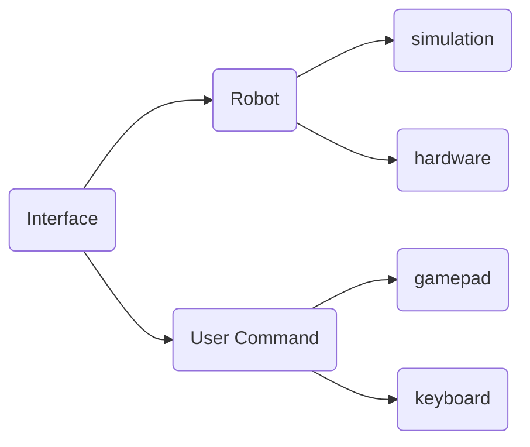
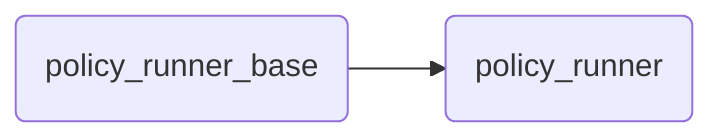

[English](./README_EN.md)

[](https://discord.gg/gdM9mQutC8)

## Tutorial Video
欢迎在[Bilibili](https://b23.tv/UoIqsFn)或者[YouTube](https://youtube.com/playlist?list=PLy9YHJvMnjO0X4tx_NTWugTUMJXUrOgFH&si=pjUGF5PbFf3tGLFz)观看教程视频，学习如何训练和部署强化学习策略。

# 仿真-仿真
```bash
# segmentation debug 工具安装
sudo apt-get install libdw-dev
wget https://raw.githubusercontent.com/bombela/backward-cpp/master/backward.hpp
sudo mv backward.hpp /usr/include

# 依赖安装 (python3.10)
pip install pybullet "numpy < 2.0" mujoco
git clone --recurse-submodule https://github.com/DeepRoboticsLab/Lite3_rl_deploy.git

# 编译
mkdir build && cd build
cmake .. -DBUILD_PLATFORM=x86 -DBUILD_SIM=ON -DSEND_REMOTE=OFF
# 指令解释
# -DBUILD_PLATFORM：电脑平台，Ubuntu为x86，机器狗运动主机为arm
# -DBUILD_SIM：是否使用仿真器，如果在实机上部署设为OFF 
make -j
```

```bash
# 运行 (打开两个终端)
# 终端1 (pybullet)
cd interface/robot/simulation
python3 pybullet_simulation.py

# 终端1 (mujoco)
cd interface/robot/simulation
python3 mujoco_simulation.py

# 终端2 
cd build
./rl_deploy
```

### 操控(终端2)

tips：可以将仿真器窗口设为始终位于最上层，方便可视化

- z： 机器狗站立进入默认状态
- c： 机器狗站立进入rl控制状态
- wasd：前后左右
- qe：顺逆时针旋转


# 仿真-实际
此过程和仿真-仿真几乎一模一样，只需要添加连wifi传输数据步骤，然后修改编译指令即可。目前默认实机操控为retroid手柄模式，如需使用键盘模式，可在state_machine/state_machine.hpp中第121行更改为
```bash
uc_ptr_ = std::make_shared<KeyboardInterface>();
```
修改ip：进入jy_exe/conf/network.toml，修改ip为以下内容
```bash
ip = '192.168.2.1'
target_port = 43897
local_port = 43893

ips = ['192.168.1.103']
ports = [43897]
```
```bash
# apply code_modification

# 电脑和手柄均连接机器狗WiFi
# WiFi名称为 Lite*******
# WiFi密码为 12345678 (一般为这个，如有问题联系技术支持)

# scp传输文件 (打开本地电脑终端)
scp -r ~/Lite3_rl_deploy ysc@192.168.2.1:~/

# ssh连接机器狗运动主机以远程开发，密码有以下三种组合
#Username	Password
#ysc		' (a single quote)
#user		123456 (推荐)
#firefly	firefly
ssh ysc@192.168.2.1
# 输入密码后会进入远程开发模式

# 编译
cd Lite3_rl_deploy
mkdir build && cd build
cmake .. -DBUILD_PLATFORM=arm -DBUILD_SIM=OFF -DSEND_REMOTE=OFF
# 指令解释
# -DBUILD_PLATFORM：电脑平台，Ubuntu为x86，机器狗运动主机为arm
# -DBUILD_SIM：是否使用仿真器，如果在实机上部署设为OFF 
make -j 
./rl_deploy
```

## 操控(手柄)

参考https://github.com/DeepRoboticsLab/gamepad

## 模型转换

运行RL训练出的策略文件需要链接onnxruntime库，而onnxruntime支持的模型为.onnx格式，需要手动转换.pt模型为.onnx格式。

可以通过运行policy文件夹中的pt2onnx.py文件将.pt模型转化为.onnx模型。注意观察程序输出对两个模型一致性的比较。

首先配置和验证程序运行环境

```bash
pip install torch numpy onnx onnxruntime

python3 -c 'import torch, numpy, onnx, onnxruntime; print(" All modules OK")'
```

然后运行程序

```bash
cd your/path/to/LITE3_RL_DEPOLY/policy/

python pt2onnx.py
```
就可以在当前文件夹看到对应的.onnx模型文件了


## 各模块介绍

### state_machine




state_machine模块是Lite3在不同的状态之间来回切换，不同的状态代表的功能如下：

1.Idle 空闲状态，表示机器狗处于关节不发力的情况

2.StandUp 站起状态，表示机器狗从趴下到站起的动作

3.RL RL控制状态，表示机器狗执行策略输出的action

4.JointDamping 关节阻尼状态，表示机器狗的关节处于阻尼控制状态

### interface



interface模块表示机器狗的数据接受和下发接口和手柄控制的输入。其中机器狗平台的输入分为仿真和实物，手柄的输入分为键盘和手柄控制。

### run_policy



这部分用于执行RL策略的输出，新的策略可以通过继承policy_runner_base实现。
