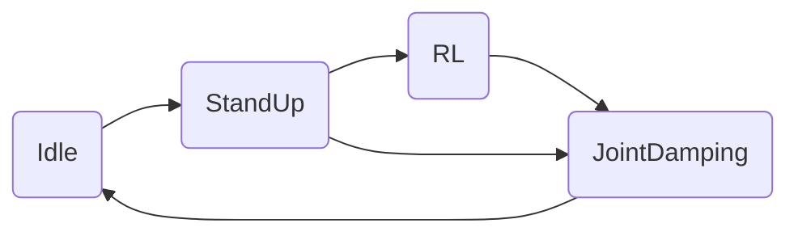
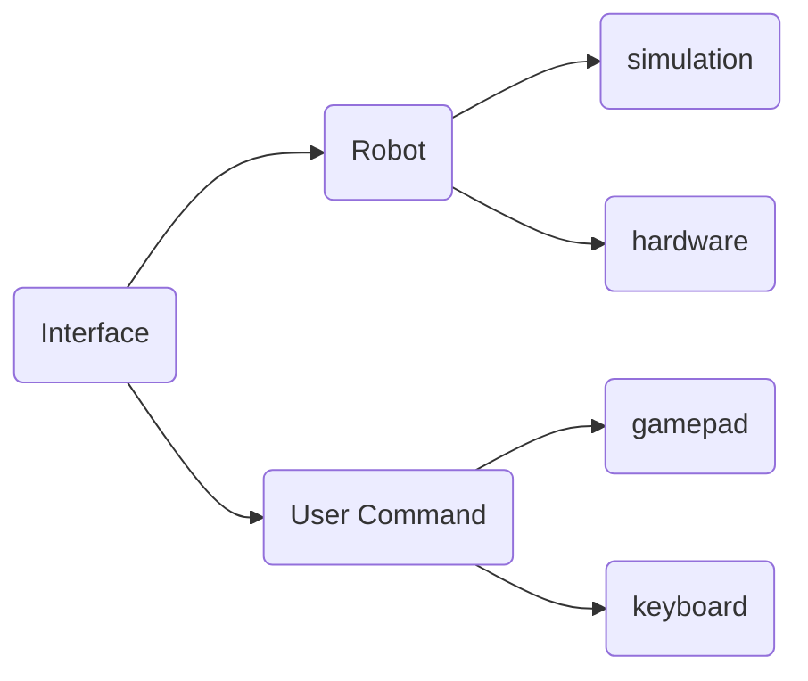
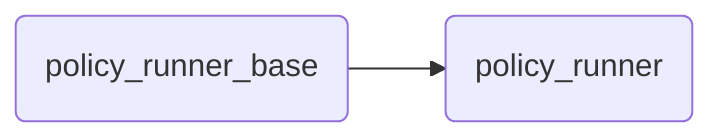

[简体中文](./README.md)

## Sim-to-Sim

```bash
# segmentation debug tools install
sudo apt-get install libdw-dev
wget https://raw.githubusercontent.com/bombela/backward-cpp/master/backward.hpp
sudo mv backward.hpp /usr/include

# Dependency install (python3.10)
pip install pybullet "numpy < 2.0" mujoco
git clone --recurse-submodule https://github.com/DeepRoboticsLab/Lite3_rl_deploy.git

# compile
mkdir build && cd build
cmake .. -DBUILD_PLATFORM=x86 -DBUILD_SIM=ON -DSEND_REMOTE=OFF

# Explanation
# -DBUILD_PLATFORM：device platform，Ubuntu is x86，quadruped is arm
# -DBUILD_SIM：whether or not to use simulatior, if deployed on real robots, set to OFF 
make -j
```

```bash
# run (open 2 terminals)
# Terminal 1 (pybullet)
cd interface/robot/simulation
python pybullet_simulation.py

# Terminal 1 (mujoco)
cd interface/robot/simulation
python mujoco_simulation.py

# Terminal 2 
cd build
./rl_deploy
```

## Usage(Terminal 2)

tips：right click simulator window and select "always on top"

- z： default position
- c： rl control default position
- wasd：forward/leftward/backward/rightward
- qe：clockwise/counter clockwise

change quadruped ip: go to jy_exe/conf/network.toml, change ip to 192.168.2.1
# Sim-to-Real
This process is almost identical to simulation-simulation. You only need to add the step of connecting to Wi-Fi to transfer data, and then modify the compilation instructions. Currently, the default real-machine control mode is Retroid controller mode. If you need to use keyboard mode, you can change state_machine/state_machine.hpp line121 to
```bash
uc_ptr_ = std::make_shared<KeyboardInterface>();
```
```bash
# apply code_modification

# computer and gamepad should both connect to WiFi
# WiFi: Lite*******
# Passward: 12345678 (If wrong, contact technical support)

# scp to transfer files to quadruped (open a terminal on your local computer)
scp -r ~/Lite3_rl_deploy ysc@192.168.2.1:~/

# ssh connect for remote development, the passward has the following 3 combinations
#Username	Password
#ysc		' (a single quote)
#user		123456 (Recommended)
#firefly	firefly
ssh ysc@192.168.2.1
# enter your passward, the terminal will be active on the qurdruped computer

# compile
cd Lite3_rl_deploy
mkdir build && cd build
cmake .. -DBUILD_PLATFORM=arm -DBUILD_SIM=OFF -DSEND_REMOTE=OFF 
# Explanation
# -DBUILD_PLATFORM：device platform，Ubuntu is x86，quadruped is arm
# -DBUILD_SIM：whether or not to use simulatior, if deployed on real robots, set to OFF 
make -j
./rl_deploy
```

## Usage(Retroid gamepad)

Please refer to https://github.com/DeepRoboticsLab/gamepad

## Model Conversion

To run the policy file trained with RL, you need to link the onnxruntime library, which supports models in the .onnx format. Therefore, you must manually convert the .pt model to the .onnx format.

You can convert the .pt model to the .onnx model by running the pt2onnx.py file in the policy folder. Pay attention to the program output to compare the consistency between the two models.

First, configure and verify the program runtime environment:

```bash
pip install torch numpy onnx onnxruntime

python3 -c 'import torch, numpy, onnx, onnxruntime; print(" All modules OK")'
```

Then, run the program:

```bash
cd your/path/to/LITE3_RL_DEPOLY/policy/

python pt2onnx.py
```

Afterward, you will see the corresponding .onnx model file in the current folder.

### state_machine




The state_machine module is where Lite3 switches between different states, the different states represent the following functions:

1.Idle : Idle state, indicating that the robot is in a situation where the joints do not enabled.

2.StandUp : Stand up state, indicating the action of the robot dog from sit to stand.

3.RL : RL control state，indicating the action output by the robot execution strategy.

4.JointDamping : Joint damping state, indicating that the joints of the robot are in the damping control state

### interface



The interface module represents the inputs for the dog's data receiving and sending interface and joystick control. Among them, the inputs of the robot platform are divided into simulation and physical, and the inputs of the controller are divided into keyboard and joystick control.

### run_policy



This section is used to execute the output of the RL policy, new policies can be implemented by inheriting policy_runner_base.


