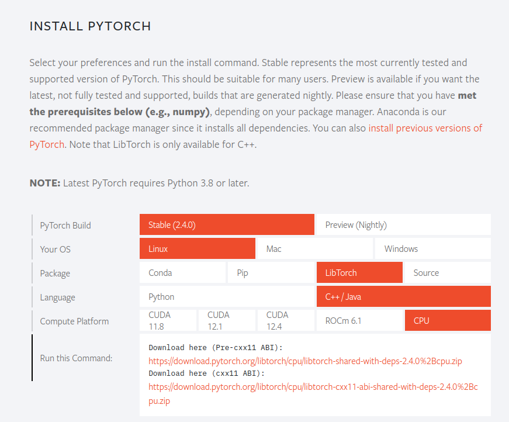
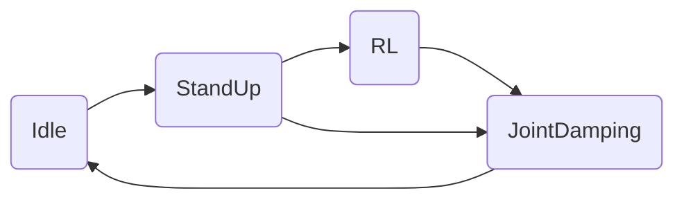
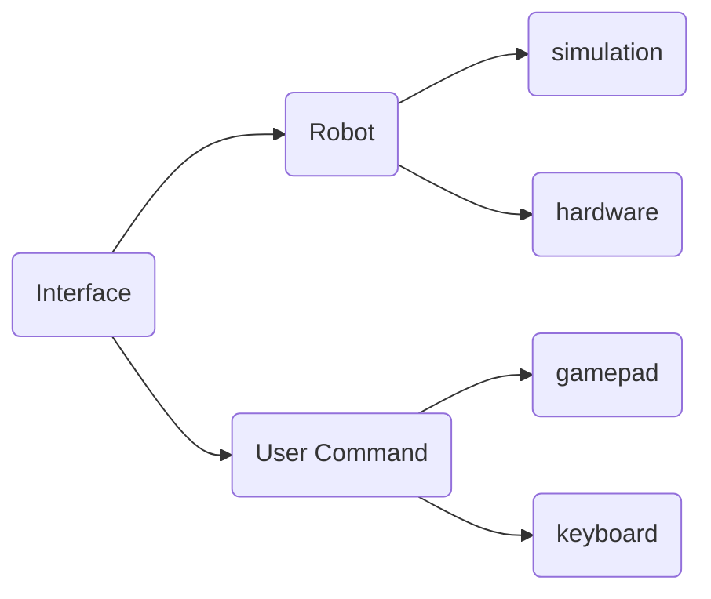
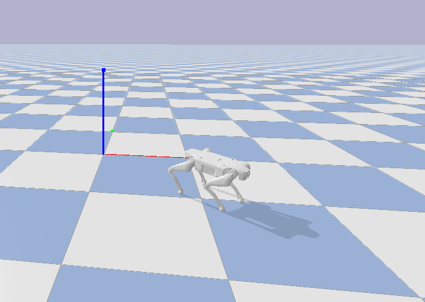

# RL_DEPLOY

[简体中文](./README.md)

## Download and Compile

```bash
git clone --recurse-submodules https://github.com/DeepRoboticsLab/Lite3_rl_deploy.git
mkdir build && cd build
cmake .. -DBUILD_PLATFORM=x86 -DBUILD_SIM=off -DSEND_REMOTE=OFF 
make -j4
```

### Cautions:

1.Lite3 sports motherboard is arm architecture, if compiled to run on the dog need to install cross-compile tools.

```bash
sudo apt-get install gcc-aarch64-linux-gnu g++-aarch64-linux-gnu
```

2.Running the policy file trained by RL requires linking to the libtorch library, which needs to be downloaded or compiled from the official website (https://pytorch.org/) depending on the architecture and configuration of the running host. Because the libtorch program is rather large, it is not added in the repository. If there is a need for libtorch libraries for arm architecture CPU-based (Lite3 motion host architecture), you can leave a message in issues.



3.The remote control given in the current example follows the controller input, it is recommended to test the controller communication in advance to see if it is working properly according to the introduction in [gamepad](https://github.com/DeepRoboticsLab/gamepad.git) in advance.

4.The sample program gives a simulation verification program based on the pybullet platform, if interested go to https://pybullet.org/wordpress/ for details.


## Introduction to Each Module

### state_machine




The state_machine module is where Lite3 switches between different states, the different states represent the following functions:

1.Idle : Idle state, indicating that the robot is in a situation where the joints do not enabled.

2.StandUp : Stand up state, indicating the action of the robot dog from sit to stand.

3.RL : RL control state，indicating the action output by the robot execution strategy.

4.JointDamping : Joint damping state, indicating that the joints of the robot are in the damping control state

### interface



The interface module represents the inputs for the dog's data receiving and sending interface and joystick control. Among them, the inputs of the robot platform are divided into simulation and physical, and the inputs of the controller are divided into keyboard and joystick control.

### run_policy


This section is used to execute the output of the RL policy, new policies can be implemented by inheriting policy_runner_base.


## Steps for live deployment

### 1. Local computer cross-compile deployment

1.Prepare Ubuntu computer with system 18.04 or 20.04, if not you need to scp the program to the motion host to compile and run it.

2.Install the expect script interpreter on your computer. 

```shell
sudo apt-get install expect
```

3.Connect to the robot's wifi 

4.Execute the scp_torch_to_remote.sh script in the `rl_deploy/scripts` directory locally, taking care to modify the ip and username defined in the script 

5.ssh [ysc@192.168.1.120](mailto:ysc@192.168.1.120) connect into the robot's motion host. Modify the `~/jy_exe/conf/network.toml` file in the Lite3 motion host to change the ip entry to the motion host's local ip 127.0.0.1 or other local ip. Then re-execute the `sudo ~/jy_exe/restart.sh` script to restart the motion program.

6.Go to the local `rl_deploy` folder and perform the compile execution process.

```shell
 mkdir build 
 cd build 
 cmake .. -DBUILD_PLATFORM=arm -DBUILD_SIM=off -DSEND_REMOTE=ON 
 make -j4 
```

7.Execute `./rl_deploy`. Observe whether the program works properly and solve specific problems. Implement keyboard control or joystick control.


### 2. Lite3 Motion Host Deployment

1.Drag or scp the `rl_deploy` folder into the root directory of the motion host. 

2.Connect to the robot's wifi 

3.ssh [ysc@192.168.1.120](mailto:ysc@192.168.1.120)connect into the robot's motion host. Modify `~/jy_exe/conf/network.toml` to change the ip entry to the local ip of the motion host [127.0.0.1] (http://127.0.0.1), then re-execute the `sudo ~/jy_exe/restart.sh` script to restart the motion program. 

4.Remotely connect to the robot, go to the `rl_deploy` folder and perform the compile execution process. 

```shell
mkdir build 
cd build 
cmake .. -DBUILD_PLATFORM=arm -DBUILD_SIM=off -DSEND_REMOTE=OFF 
make -j4 
```

5.Execute `./rl_deploy`. Observe whether the program works properly and solve specific problems. Implement keyboard control or joystick control.


### 3.Local Direct Run

1.Utilizing connecting finger with a wired connection to the Lite3, and able to ping the motion host `192.168.1.120` through this machine.

2.ssh [ysc@192.168.1.120](mailto:ysc@192.168.1.120)connect into the robot's motion host. Modify `~/jy_exe/conf/network.toml` to change the ip entry to the local ip of the motion host (192.168.1.xxx), then re-execute the `sudo ~/jy_exe/restart.sh` script to restart the motion program.

3.Local compilation passed.

4.Execute `./rl_deploy`.


## Simulation Verification

The program can also be verified with other simulation platforms to verify that the motion program works properly, which can be verified with pybullet (Raisim). pybullet simulation and the C++ motion program are communicating in real time via UDP. In order to realize the simulation verification, you need to install the corresponding python as well as the simulation environment.

1.Make sure python and pybullet are installed locally (just install them via `pip install pybullet`), and make sure pybullet can be imported and opened normally.

2.Execute the command to open the simulation environment, here you need to decompress the compressed files in the `third_party/URDF_model/lite3_urdf/` directory.

```bash
cd interface/robot/simulation
python pybullet_simulation.py
```

3.Compile the program, need to consider the compilation options for the emulation.

```bash
mkdir build 
cd build 
cmake .. -DBUILD_PLATFORM=x86 -DBUILD_SIM=ON -DSEND_REMOTE=OFF 
make -j4 
```

4.Execute the compiled executable to realize the control of the robot in the pybullet environment. Subsequent development can be verified in the simulation environment first.



